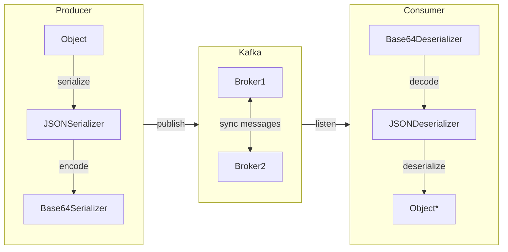

# Kafka SerDes

This project demonstrates how to build custom SerDes for Kafka.

## Base64 SerDe

The base64 SerDe wraps another SerDe and encodes/decodes the serialized bytes using Base64 encoding.



## Local Kafka

Confluent provide several convenient options to run Kafka locally via Docker and Docker Compose.

https://github.com/confluentinc/cp-all-in-one

```shell
docker compose up -d
```

## Maintananace

```shell
mvn clean install
```
